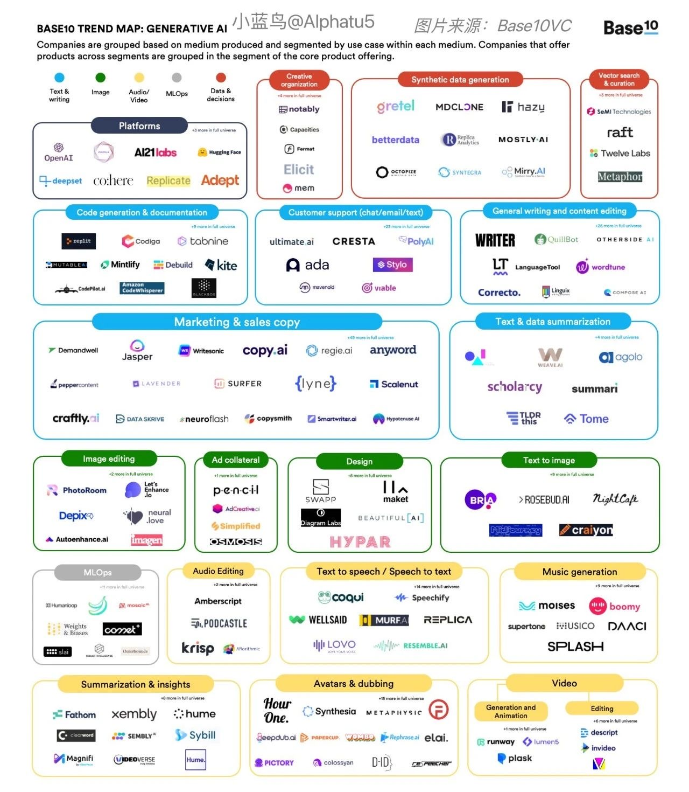

## AIGC

### 平台

- [DALL·E 2](https://openai.com/dall-e-2/)

    - http://arxiv.org/abs/2204.06125
    - [DALLE2-pytorch](https://github.com/lucidrains/DALLE2-pytorch)

- [Stable Diffusion](https://stablediffusionweb.com)

    - [Dreamstudio](https://beta.dreamstudio.ai)
    - [stability-ai/stable-diffusion](https://replicate.com/stability-ai/stable-diffusion)

- [Disco Diffusion](https://colab.research.google.com/github/alembics/disco-diffusion/blob/main/Disco_Diffusion.ipynb)

    - [disco-diffusion - github](https://github.com/alembics/disco-diffusion)
    - [人工智能绘画工具 Disco Diffusion 入门教程](https://zhuanlan.zhihu.com/p/563831317)

- [Midjourney](https://midjourney.com/)
- [jina](https://jina.ai/)

    - [discoart - github](https://github.com/jina-ai/discoart)
    - [disco-diffusion - replicate](https://replicate.com/nightmareai/disco-diffusion)

- [Imagen](https://imagen.research.google/)
- [百度·文心一格](https://yige.baidu.com/)
- [Draft](https://draft.art/)

### 算法

- [stable-diffusion](https://huggingface.co/spaces/stabilityai/stable-diffusion) - Stable Diffusion is a state of the art text-to-image model that generates images from text.

### 产品

- [AI Art Generator](https://creator.nightcafe.studio/) - Create amazing artworks using the power of Artificial Intelligence.
- [Novel AI](https://novelai.net/)
- [Alpha 造图](https://www.iplaysoft.com/alpha-zaotu.html)
- [意间 AI 绘画](http://yjai.ai-galaxy.com/)
- [DiffusionBee](https://diffusionbee.com/) - 一个 MacOS 应用，将 Stable Diffusion 模型做成一个安装包，带有图形界面，号称是苹果电脑使用该模型的最容易方法。
- [Charl-E](https://www.charl-e.com/) - CHARL-E packages Stable Diffusion into a simple app. No complex setup, dependencies, or internet required — just download and say what you want to see.
- [imaginAIry](https://github.com/brycedrennan/imaginAIry) - AI imagined images. Pythonic generation of stable diffusion images.
- [滴墨社区 - AI绘画](https://www.domo.cool/introduction)

### 素材

- [Lexica](https://lexica.art/?)

### 云服务

- [Replicate](https://replicate.com) - You can use Replicate to run machine learning models in the cloud from your own code, without having to set up any servers.

    - [Text to image](https://replicate.com/collections/text-to-image)

- [Colaboratory](https://colab.research.google.com/)

    - [苦逼学生党的Google Colab使用心得](https://zhuanlan.zhihu.com/p/54389036)
    - [colab运行stable diffusion以及本地部署方法](https://zhuanlan.zhihu.com/p/561546984)

### 文献

- [State of AI Report 2022](https://www.stateof.ai/)
- [【个人翻译】AI绘画工具DALLE2、MidJourney与Stable Diffusion的对比](https://www.bilibili.com/read/cv18290360?from=articleDetail)
- [理解 DALL·E 2， Stable Diffusion 和 Midjourney 的工作原理](https://xie.infoq.cn/article/2c3b18864176bed4fbc0d576c)
- [AI作图创业高潮：国内有小程序日增65万用户，海外有产品月入近百万美金](https://www.baijing.cn/article/41647)
