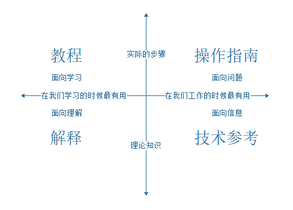

# 写作

## 基础

### 类型

- 教程：像一门课程，完全以学习为向导，向初学者展示项目功能，指导初学者执行一系列动作来达到某些目标
- 操作指南：操作指南完全是以目标为导向，用于解决特定的问题。
- 解释文档：解释文档以理解作为基本向导，用于澄清和阐明特定主题。
- 技术参考：以信息作为基本导向，提供丰富信息，严肃而中肯，文档要准确且完整。

### 题材

- 新出现的技术
- 工程中解决问题的方法
- 高深问题的剖析
- 被大多数人忽略的重要细节

## 方法

### 5W2H

- [5W2H分析法](https://baike.baidu.com/item/5W2H分析法/8111597) / [Project Management 101: The 5 Ws (and 1 H) that should be asked of every project!](https://www.workfront.com/blog/project-management-101-the-5-ws-and-1-h-that-should-be-asked-of-every-project)
- [是什么？为什么？怎么样？](http://www.china.com.cn/xxsb/txt/2004-05/25/content_5572117.htm) / [Ask What, Why, and How to gain Purpose and Perspective](https://medium.com/@Bar_Code/purpose-and-perspective-through-what-why-and-how-e158bf63e764)

- [关于消息推送的思考：是什么？为什么？怎么做？](https://www.yunyingpai.com/app/459645.html)

### 使用列表

...

### 使用表格

...

### 使用图表

...

### 肯定句式

...

### 排版规范

- [中文文案排版指北](https://github.com/sparanoid/chinese-copywriting-guidelines)

## 工具

- 代码转图片：[Carbon](https://carbon.now.sh/)
- 语法风格、拼写检查器：[LanguageTool](https://languagetool.org/)

## 实践

### 如何编写 README

- 模板

    - [jxson/README.md](https://gist.github.com/jxson/1784669)
    - [PurpleBooth/README-Template.md](https://gist.github.com/PurpleBooth/109311bb0361f32d87a2)
    - [Make a README](https://www.makeareadme.com/)
    - [standard-readme](https://github.com/RichardLitt/standard-readme)
    - 美柚业务项目

        - 项目文档：需求文档，设计稿，接口等
        - 功能概述：功能结构辅以复杂业务的流程图
        - 技术选型：服务端，客户端各自采用了什么技术
        - 项目结构：目录结构，路由设计等
        - 开发说明：分支管理，安装依赖，启动开发环境，编码规范等
        - 部署说明：测试环境，预发环境，生产环境

- 参考文献

    - [如何编写开源项目的 README 文档](https://blog.coding.net/blog/how-to-make-readme)
    - [[译] 如何编写友好的 README](https://segmentfault.com/a/1190000006834614)
    - [README 文档养成记](https://linuxstory.org/writing-a-friendly-readme/)
    - [art-of-readme](https://github.com/noffle/art-of-readme)
    - [About READMEs](https://help.github.com/articles/about-readmes/)
    - [README Wikipedia](https://en.wikipedia.org/wiki/README)

## 案例

- [Web Development for Beginners](https://microsoft.github.io/Web-Dev-For-Beginners/#/)

    每个课程包括：

    1. 随意草稿
    2. 可选的补充视频
    3. 课前热身测验
    4. 书面教材
    5. 对于基于项目的经验教训，一步一步指导如何建立项目
    6. 知识检查
    7. 一个挑战
    8. 补充阅读
    9. 其他教程
    10. 课后测验

## 参考文献

- [程序员怎样才能写出一篇好的博客或者技术文章？](https://www.zhihu.com/question/40716838)
- [如何才能写出一篇好的技术文章](https://www.jianshu.com/p/06a50b44a776)
- [分享下写技术文章的思路](https://blog.fundebug.com/2018/09/29/how-to-write-technology-blog/)
- [程序员怎样才能写出一篇好的博客或者技术文章](https://cloud.tencent.com/developer/article/1191547)
- [如何写文章 - wiki how](https://zh.wikihow.com/%E5%86%99%E6%96%87%E7%AB%A0)
- [中文技术文档的写作规范 - 阮一峰](https://www.ruanyifeng.com/blog/2016/10/document_style_guide.html)
